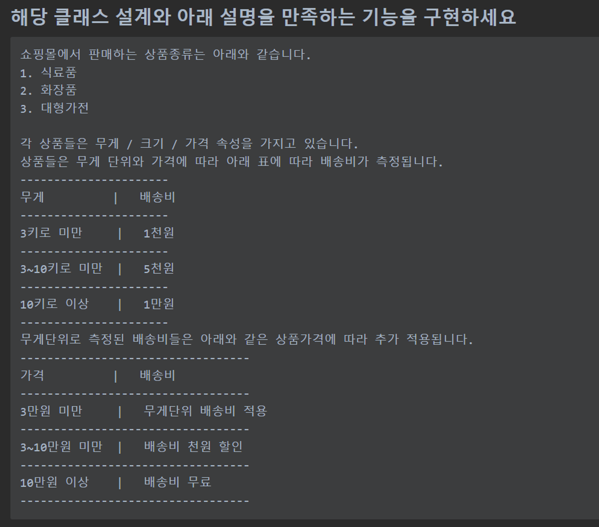
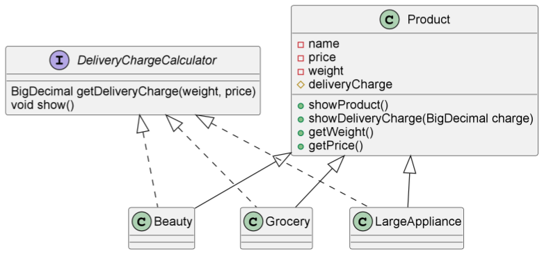

# Java Week 2 Weekly Quiz

## 기능 명세서

## UML

## 기능 설명
### OrderService.java
- 상품별로 다른 클래스를 활용하여 여러가지 상품 클래스 생성
- 생성된 상품들을 ArrayLIst를 통해서 삽입
- forEach를 활용해서 상품별로 제품 설명 & 배송비 출력

### product.java
- `showProduct()` : 상품 정보를 출력하는 메소드
- `showDeliverCharge(BigDecimal charge)` : 배송비를 출력하는 메소드

### interface DeliveryChargeCalculator
- `getDeliveryCharge(BigDecimal weight, BigDecimal price)` : 배송비를 계산해서 반환해주는 메소드
  - 세 상품 모두 같은 배송비를 적용하므로, `default`를 활용해서 interface 안에서 구현해 주었다. 
- `void show();` : 상품 정보와 배송비를 출력해주는 메소드