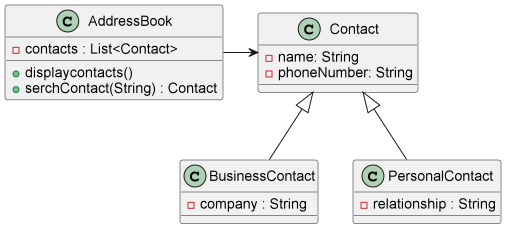

# Weekly Quiz 3 - 연락처 관리 프로그램

## 📝 기능 설명

### 기능 1. 메뉴 선택
- 프로그램 실행시, 아래의 메뉴 선택 화면이 출력된다.
```
1. 비즈니스 연락처 추가
2. 개인 연락처 추가
3. 연락처 출력
4. 연락처 검색
5. 종료
   메뉴를 선택해주세요: ↵
```
- 사용자는 1 ~ 5 사이의 번호를 입력해서 메뉴를 선택할 수 있다.
  - `Scanner` 클래스 사용

### 기능 2. 비즈니스 연락처 추가
- 사용자가 1번 메뉴를 선택했을 경우 아래의 화면이 출력된다.
```
이름을 입력하세요: ↵
전화번호를 입력하세요: ↵
회사명을 입력하세요: ↵
```
- 사용자가 이름, 전화번호, 회사명을 입력 가능하다.
- 입력이 완료되면 메뉴 선택 화면으로 돌아간다.

### 기능 3. 개인 연락처 추가
- 사용자가 2번 메뉴를 선택했을 때 아래의 화면이 출력된다.
```
이름을 입력하세요: ↵
전화번호를 입력하세요: ↵
관계를 입력하세요: ↵
```
- 사용자는 이름, 전화번호, 관계를 입력할 수 있다.
- 사용자 입력이 완료되면 메뉴 선택 화면으로 돌아간다.

### 기능 4. 연락처 출력
- 사용자가 3번 메뉴를 선택했을 때 현재까지 추가한 모든 연락처를 아래의 화면처럼 출력한다.
```
이름: 오르미, 전화번호: 010-1234-5678, 회사명: ESTsoft
이름: 오름이, 전화번호: 010-8765-4321, 관계: 친구
```
- 비즈니스 연락처는 이름, 전화번호, 회사명을 출력한다.
- 개인 연락처는 이름, 전화번호, 관계를 출력한다.
   

- 단, 연락처 정보가 없는 경우 아래와 같은 화면을 출력한다.
```
연락처가 비어있습니다.
```
- 연락처 출력이 완료되면 메뉴 선택 화면으로 돌아간다.

### 기능 5. 연락처 검색
- 사용자가 4번 메뉴를 선택했을 때 이름을 입력할 수 있고, 연락처에 해당 이름이 있을 경우 출력한다.

```
검색할 이름을 입력하세요: ↵
```

- 이름이 일치하는 연락처가 있을 경우 화면에 출력한다.
- 동일한 이름의 연락처가 여러 개 있다면 모두 출력한다.   
<출력 예시>
```
검색할 이름을 입력하세요: 오르미↵
이름: 오르미, 전화번호: 010-1234-5678, 회사명: ESTsoft
```
```
검색할 이름을 입력하세요: 오름이↵
이름: 오르미, 전화번호: 010-8765-4321, 관계: 친구
```
- 비즈니스 연락처는 이름, 전화번호, 회사명을 출력한다.
- 개인 연락처는 이름, 전화번호, 관계를 출력한다.
- 만약 일치하는 이름의 연락처가 없다면 아래 화면을 출력한다.
```
연락처를 찾을 수 없습니다.
```
- 연락처 검색이 완료되면 메뉴 선택 화면으로 돌아간다.

### 기능 6. 종료
- 사용자가 5번 메뉴를 선택했을 때 프로그램을 종료한다.
***
## 🗺 클래스 다이어그램


***
## 🛠 상세 기능
### 📦 Model `domain`
- **`AddressBook.java`**
  - 모든 연락처를 가지고 있는 클래스
  - `addContact(newContact)` : 연락처를 추가하는 메소드
  - `displayContacts()` : 모든 연락처를 출력하는 메소드
    - getter를 통해서 outView에서 출력하는 방식으로 수정
  - `serachContact(name)` : 이름이 일치하는 연락처를 찾아서 반환하는 메소드
- **`Contact.java`**
  - 기본적인 연락처를 나타내는 클래스
- **`BusinessContact`**
  - 비즈니스 연락처를 나타내는 클래스
  - Contact 클래스의 자식 클래스
- **`PersonalContact.java`**
  - 개인 연락처를 나타내는 클래스
  - Contact 클래스의 자식 클래스
### 🖥 View `view`
- **출력 `OutputView.java`**
  - `printMenu()` : 메뉴 출력
  - `printError(errorMessage)` : 에러 메세지 출력
  - `displayContacts(contacts)` : 모든 연락처 출력
  - `displaySearchContacts(contacts)` : 검색한 연락처 출력
- **입력 `InputView.java`**
  - 메뉴 입력
  - 비즈니스 연락처 입력
  - 개인 연락처 입력
  - 검색할 연락처 입력

### 🕹 Controller `Controller.java`
- 메뉴 선택 기능
- 비즈니스 연락처 추가 기능
- 개인 연락처 추가 기능
- 연락처 출력 기능
- 연락처 검색 기능
- 종료 기능

## 보완할 점
메뉴 입력시를 제외하고 예외 처리 기능을 구현하지 않았다. 

다른 입력 부분에 대해서도 예외처리를 구현해야한다. 이때, 사용자 정의 Exception을 적극적으로 활용해 보면 좋을 듯 하다.