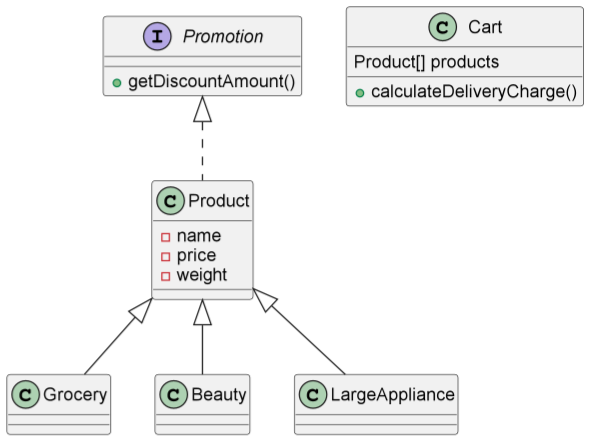

# Java Daily Quiz 02/05

## 🗺 UML

## 📑기능 설명
### Promotion
- `BigDecimal getDiscountAmount()`
  - 할인 금액을 반환하는 메소드
### Product
- `public BigDecimal getDiscountAmount()`
  - 금액에 따른 할인비용을 반환하는 메소드
  - 인터페이스 Promotion의 메소드 구현체
- `private int comparePrice(BigDecimal price,int standard)`
  - 가격을 할인 기준가와 비교해 주는 메소드
### Cart
- `BigDecimal calculateDeliveryCharge()`
  - 하나의 상품의 총 배송비를 반환하는 메소드
- `private BigDecimal deliveryCharge(double weight)`
  - 무게에 따른 배송비를 반환하는 메소드