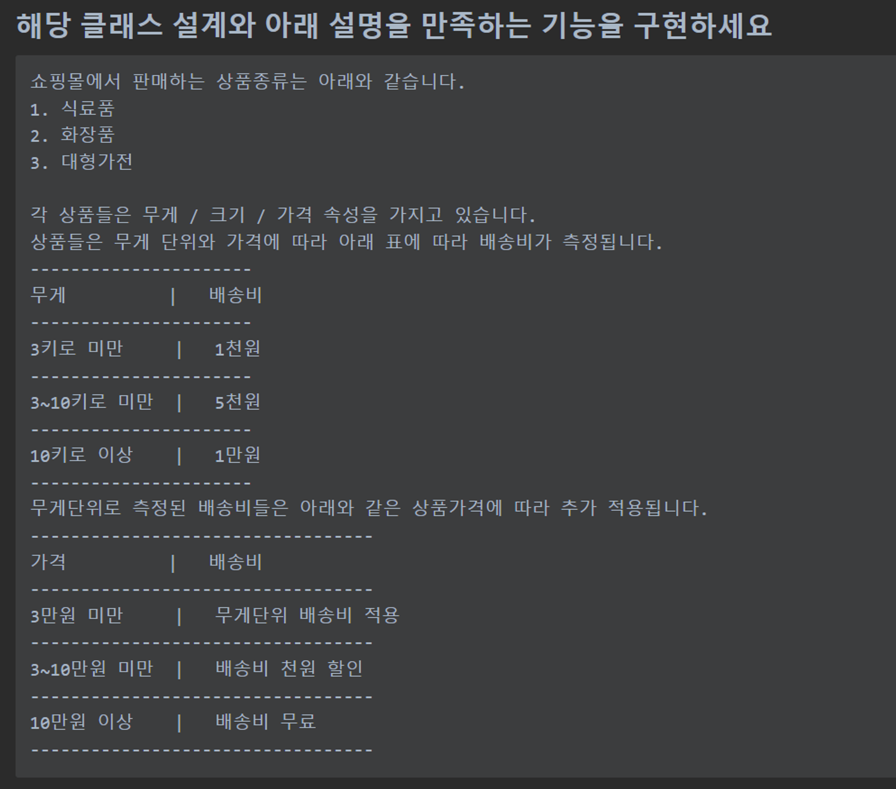

# Java Week 2 Weekly Quiz

## 기능 명세서


## UML
```mermaid 
classDiagram
    interface DeliveryChargeCalculator
    class Beauty extends Product implements DeliveryChargeCalculator
    class Grocery extends Product implements DeliveryChargeCalculator
    class LargeAppliance extends Product implements DeliveryChargeCalculator


    interface DeliveryChargeCalculator{
        BigDecimal getDeliveryCharge(weight, price)
    }

    class Product{
        + name
        + price
        + weight
    }
```